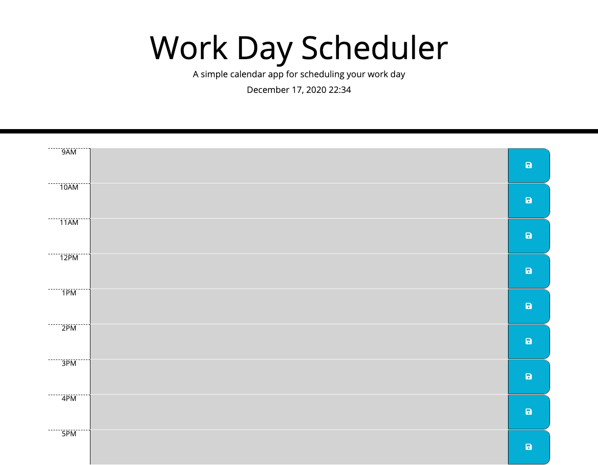

# DailyPlanner


## Purpose

This Repository is being used to develop and display a daily planner app for the work hours of 9 to 5. It will allow you to save your schedule locally on your browser and well as show you the current time and date. 

Link of working product
https://marquez-brown.github.io/DailyPlanner/

Link to Github Repository
https://github.com/Marquez-Brown/DailyPlanner

## Usage
````

- Go to https://marquez-brown.github.io/DailyPlanner/

- Type in the text to the appropriate time block

- Press save when you are finished
  
- Changes will be saved locally


````
## Recent changes 
*12-16-2020 - Built site layout and time functionality

*12-17-2020 - Added functionality for local repository

*12-17-2020 - Added Read.ME


## If you would like to contribute

To help with adding functionality, debugging, or refactoring the code, please ask for a clone of the repo, make the changes along with comments for overview and permission to push.



[](https://opensource.org/licenses/MIT)
MIT License
Copyright (c) [2020] [(MB inc.) Georgia Tech Bootcamp Project]

Permission is hereby granted, free of charge, to any person obtaining a copy
of this software and associated documentation files (the "Software"), to deal
in the Software without restriction, including without limitation the rights
to use, copy, modify, merge, publish, distribute, sublicense, and/or sell
copies of the Software, and to permit persons to whom the Software is
furnished to do so, subject to the following conditions:

The above copyright notice and this permission notice shall be included in all
copies or substantial portions of the Software.

THE SOFTWARE IS PROVIDED "AS IS", WITHOUT WARRANTY OF ANY KIND, EXPRESS OR
IMPLIED, INCLUDING BUT NOT LIMITED TO THE WARRANTIES OF MERCHANTABILITY,
FITNESS FOR A PARTICULAR PURPOSE AND NONINFRINGEMENT. IN NO EVENT SHALL THE
AUTHORS OR COPYRIGHT HOLDERS BE LIABLE FOR ANY CLAIM, DAMAGES OR OTHER
LIABILITY, WHETHER IN AN ACTION OF CONTRACT, TORT OR OTHERWISE, ARISING FROM,
OUT OF OR IN CONNECTION WITH THE SOFTWARE OR THE USE OR OTHER DEALINGS IN THE
SOFTWARE.
